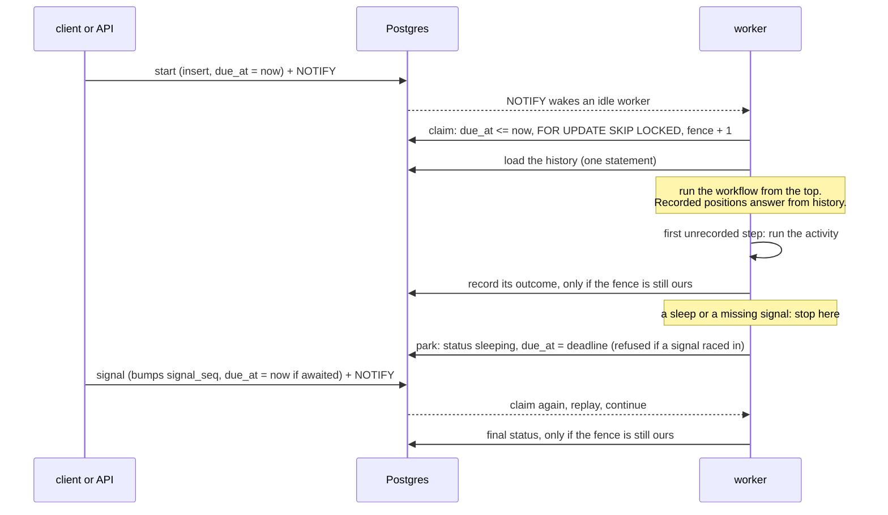

# ratchet

Durable workflows for async Python, with Postgres as the only moving part.

You write a workflow as an ordinary `async def`. Ratchet records the outcome of every step in Postgres, so when a
worker dies halfway through, another worker runs the same function from the top, gets the recorded results back
instantly, and carries on from the first step that never finished. Timers can last days without holding a worker.
Signals wake a parked workflow. A failure halfway through can undo what came before.

```python
@registry.workflow("fulfil_order")
async def fulfil_order(ctx: WorkflowContext, order: Order) -> Receipt:
    async with Saga(ctx) as saga:
        hold = await ctx.step(reserve_stock, order)
        saga.on_failure(release_stock, hold)

        charge_id = await ctx.step(charge_card, order)  # retried with backoff, recorded once
        saga.on_failure(refund, charge_id)

        if order.amount >= APPROVAL_THRESHOLD:  # parks for up to a day, holding no worker
            decision = await ctx.wait_for_signal("approval", timeout=timedelta(hours=24), payload_type=dict)
            if not decision.get("approved"):
                raise OrderRejected(order.order_id)  # refund, then release, newest first

        tracking = await ctx.step(ship, order)
    return Receipt(order_id=order.order_id, status="shipped", charge_id=charge_id, tracking=tracking)
```

That is [examples/orders.py](examples/orders.py), and it is what the compose stack below runs.

## What it promises, and the test that holds it to that

| promise | proof |
|---|---|
| Whatever crashes happen, and wherever, each step's outcome is recorded exactly once and the workflow ends with the same result as an uninterrupted run | `tests/integration/test_crash_property.py`: Hypothesis picks up to four crash points before or after each step's side effect, including inside parallel branches |
| A worker killed with SIGKILL mid-activity loses nothing recorded, and only the interrupted step runs again | `tests/integration/test_kill.py`: a real worker process, killed, and a second process finishing the job |
| A worker whose lease was taken over cannot record anything, however late it wakes | `test_a_worker_whose_lease_was_taken_over_cannot_record_anything`, `test_every_fenced_write_refuses_a_stale_fence` |
| A signal arriving between "is there a signal?" and "then I'll sleep" is not lost | `test_a_signal_landing_between_the_check_and_the_park_is_not_lost` |
| A database outage never marks a workflow failed | `test_losing_the_database_mid_step_leaves_the_workflow_for_another_run_instead_of_failing_it` |
| Code that no longer matches a workflow's history parks it until a fix is deployed, instead of failing it | `test_changed_code_stalls_the_workflow_instead_of_failing_it_and_a_fix_resumes_it` |

Activities themselves are **at-least-once**: a crash after an activity's side effect and before its outcome is
recorded means it runs again. Each activity gets an idempotency key that is stable across retries and crashes, so the
system on the other side can make that harmless. [ADR 5](docs/adr/0005-activities-are-at-least-once.md) explains why no
engine can promise more on its own.

## Numbers

On a laptop (Core Ultra 7 255H, Postgres 18 in Docker Desktop, four worker processes), full details in
[docs/benchmark-results](docs/benchmark-results/2026-10-03-laptop.md):

| | result |
|---|---|
| draining 5,000 three-step workflows | 896 workflows/s, 2,689 steps/s |
| 200 workflows/s, open loop, start to finish | p50 22 ms, p95 100 ms, p99 203 ms |
| replaying a recorded history on wake | 1.3 microseconds per step |

The first run of that benchmark measured 331 workflows a second and also found a real bug: a connection-pool
exhaustion that permanently failed workflows. Both fixes, and the before and after, are in
[ADR 7](docs/adr/0007-engine-interrupts-are-base-exceptions.md) and [ADR 8](docs/adr/0008-asyncpg-and-plain-sql.md).

## Quick start

Needs Docker.

```sh
docker compose up --build --wait
```

That starts Postgres, runs the migrations, and brings up the API on `127.0.0.1:8200` and two workers serving the order
example. Then work through [requests.http](requests.http) top to bottom, or run the same walk-through as a script:

```sh
uv run python tools/smoke.py
```

To use it in your own code: `uv add` this repository, define a `Registry` with your activities and workflows, run
`ratchet migrate`, then `ratchet worker` and (if you want HTTP) `ratchet api` with `RATCHET_APP=yourmodule:registry`.
From Python, `ratchet.client.Client` starts, signals, cancels and reads workflows without the API.

## How it works



- **Replay by position.** Every durable call takes the next position in the history when it is made, not when it is
  awaited, so `asyncio.TaskGroup` branches replay identically. A recorded position returns its outcome; an unrecorded
  one does the work. [ADR 2](docs/adr/0002-replay-with-positions-taken-at-call-time.md)
- **Fencing.** Each claim bumps a fence; every write checks it under a row lock in the same statement. Time comes only
  from the database. [ADR 3](docs/adr/0003-fencing-and-database-time.md)
- **One scheduling column.** Ready, leased, sleeping and retrying are all `due_at`, served by one partial index that
  finished workflows are not in. [ADR 4](docs/adr/0004-one-due-at-column.md)
- **Nothing but Postgres.** No Redis, no broker. `NOTIFY` wakes idle workers; a poll covers a lost notification.
  [ADR 1](docs/adr/0001-postgres-is-the-only-moving-part.md)

## Writing workflows

The rules are few, and they matter:

- **Between durable calls, be deterministic.** No `datetime.now()`, `random`, `uuid4()` or I/O in the workflow body.
  Use `ctx.now()`, `ctx.uuid()`, `ctx.side_effect(fn)`, or an activity. They are recorded the first time and replayed
  after.
- **Do I/O in activities.** Register them with `@registry.activity(retry=RetryPolicy(...), timeout=...)`. Arguments are
  not recorded, results are, as JSON through the return annotation.
- **Raise `NonRetryableError`** (or a subclass) from an activity to fail it without spending its retries.
- **Never catch `BaseException` in a workflow.** The engine unwinds runs with `BaseException`s (parking, a lost lease, a
  database outage) and they must pass through. [ADR 7](docs/adr/0007-engine-interrupts-are-base-exceptions.md)
- **To change a workflow with running instances**, only add calls after the point every instance has reached, or
  register the new version under a new name. [ADR 6](docs/adr/0006-stall-instead-of-failing-on-changed-code.md)

## Running the checks

```sh
uv sync
uv run ruff check . && uv run ruff format --check .
uv run mypy src tests examples benchmarks
uv run lint-imports                       # the replay core may not import the store, the API or asyncpg
uv run pytest tests/unit
uv run pytest tests/integration           # needs Docker: Postgres runs in a container
uv run python tools/license_audit.py      # every installed distribution must be permissively licensed
```

## Limitations

- Activities are at-least-once (see above).
- No versioning API, no child workflows, no continue-as-new. A workflow that loops forever hits `RATCHET_MAX_HISTORY`.
- One Postgres primary is the ceiling.
- The HTTP API authenticates with one shared bearer token.

[docs/operations.md](docs/operations.md) has the configuration table, the metrics worth alerting on, and a runbook per
failure it anticipates.

## Licence

MIT. Every dependency, at every depth, is permissively licensed, and CI checks it.
